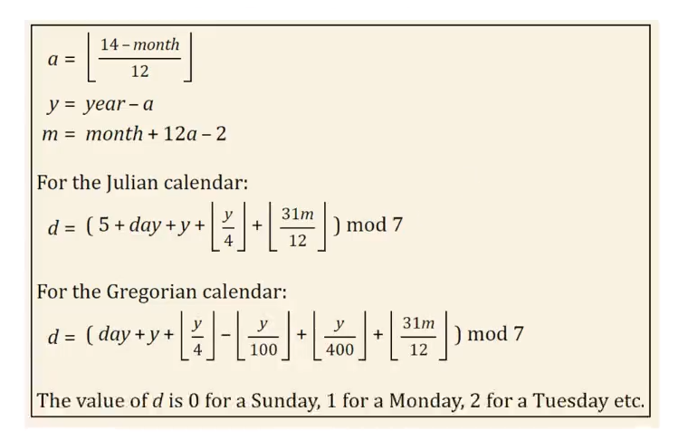

### 💡 Problem Tanımı

Bu program, kullanıcıdan geçerli bir tarih (gün, ay, yıl) girdisi alarak bu tarihin **haftanın hangi gününe** denk geldiğini hesaplar ve günün adını kullanıcıya gösterir.

📌 **Programın Kuralları:**

* Gün (1–31), ay (1–12), yıl (1–3000) aralıklarında giriş yapılmalıdır.
* Girilen tarih, özel bir algoritma kullanılarak haftanın gün sırasına (`0-6`) dönüştürülür.
* Bu sayı, gün adıyla eşleştirilerek (`Sunday`–`Saturday`) ekrana yazdırılır.

---

### ✅ Örnek Çıktı

```
Please enter a day ? 
10
Please enter a Month ? 
4
Please enter a year ? 
2023
Date : 10/4/2023
Day Order : 1
Day Name : Monday
```

---

### 🧠 Açıklama ve Kullanılan Formül

#### 📌 Kullanılan Formül: **Zeller’s Congruence** (Zeller’in Bağıntısı)



```cpp
a = (14 - month) / 12;
y = year - a;
m = month + 12 * a - 2;
return (day + y + (y / 4) - (y / 100) + (y / 400) + (31 * m / 12)) % 7;
```

Bu formül, Miladi takvime göre haftanın gününü belirlemede kullanılan güvenilir ve yaygın bir algoritmadır.

* `a`: Ocak ve Şubat aylarını bir önceki yıla taşıma işlemi için kullanılır.
* `y`: Yıl değerinin ay düzeltmesine göre güncellenmiş hali.
* `m`: Ayı, Zeller formülüne göre Mart’ı yılın başlangıcı kabul edecek şekilde dönüştürür.
* Formül sonucu: `0 = Sunday`, `1 = Monday`, ..., `6 = Saturday`

---

### 🎯 Amaç

Tarihsel hesaplamalarda haftanın gününü doğru belirlemek için algoritmik çözüm geliştirmek; ayrıca kullanıcı girdisini doğrulama, formül uygulama ve çıktı eşleme mantıklarını pekiştirmektir.
