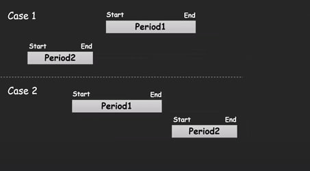

## 💡 Problem Tanımı

Bu projede, iki farklı tarih aralığının (periyotların) **çakışıp çakışmadığını** belirleyen bir program geliştirilmektedir.
Her periyot bir başlangıç ve bir bitiş tarihinden oluşur. Amaç, bu iki periyodun **ortak gün içerip içermediğini** kontrol etmektir.

Bu tür kontroller, özellikle:

* Tatil planlamalarında
* Rezervasyon sistemlerinde
* Takvim randevularında
* Zaman çizelgesi kontrollerinde
  kullanılan **kritik bir algoritmadır.**

---

## 📌 Programın İşleyişi

1. Kullanıcıdan iki periyot girilmesi istenir (`ReadPeriod` fonksiyonu).

2. Her periyot başlangıç ve bitiş tarihi içerir (`StartDate`, `EndDate`).

3. `CompareDates` fonksiyonu yardımıyla periyotların sınırları kıyaslanır .

4. `IsPeriodOverlap` fonksiyonu şu mantıkla çalışır:

   ```cpp
   if (
     EndDate2 < StartDate1 ||
     EndDate1 < StartDate2
   )
     return false; // çakışma yok
   return true;     // en az bir gün ortak
   ```

5. Sonuç olarak, program "Çakışıyor" veya "Çakışmıyor" mesajı verir.

---


---

## ✅ Örnek Çıktı

```txt
Enter Period 1 : 
Enter Start Date :
Please enter a Day
10
Please enter a month
5
Please enter a year
2024
Enter End Date :
Please enter a Day
20
Please enter a month
5
Please enter a year
2024
Enter Period 2 : 
Enter Start Date :
Please enter a Day
15
Please enter a month
5
Please enter a year
2024
Enter End Date :
Please enter a Day
25
Please enter a month
5
Please enter a year
2024

Yes, Period is Overlap
```

---


## 🛠️ Kullanılan Temel Fonksiyonlar

| Fonksiyon           | Açıklama                                                  |
| ------------------- | --------------------------------------------------------- |
| `ReadDate()`        | Gün, ay, yıl bilgisi alır                                 |
| `CompareDates()`    | Tarihler arası sıralama yapar (enum ile)                  |
| `IsPeriodOverlap()` | İki periyot arasında çakışma olup olmadığını kontrol eder |

---

## 📌 Kullanılan Veri Yapıları

```cpp
struct stDate {
  short Day, Month, Year;
};

struct stPeriod {
  stDate StartDate, EndDate;
};

enum enDateCompare { Before = -1, Equal = 0, After = 1 };
```

---

## 🎯 Amaç

Bu problem:

* Zaman bazlı verileri işleme
* Tarih karşılaştırma ve sıralama
* Gerçek dünya problemlerini algoritmik çözümleme
  konularında **önemli pratik ve altyapı sağlar.**

Aynı zamanda görsel olarak durumları analiz ederek algoritmanın doğruluğunu test etme yeteneğini de kazandırır.

> Bu algoritma, yazılım geliştirmede çok sık karşılaşılan bir yapıdır ve iyi anlaşılması **çok kritiktir.**

---

İstersen bu `RADME.md` dosyasını `.md` formatında çıktı olarak hazırlayıp verebilirim. Ayrıca örnek test verilerini de tabloya dökelim mi?
